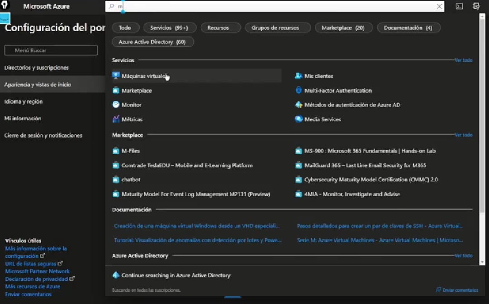

#Practica Azure Virtual Machine

----------------------------------------------------------------
##Process:
##### -We started session in Azure [Azure](https://www.portal.azure.com)
##### -In the search engine, we look for virtual machines.

----------------------------------------------------------------
##### -We need to create a resource group, or select one that we have previously created.
##### -We select the name and the region where our VM will be located.
##### -We can also select the O.S. of our MV.
##### -Once all the information has been verified, we proced to click on the verify and create button.

---------------
##### -After clicking the verify button, if everthing is correct, we click the create button.

##### -We have to wait for it to finish creating the VM.

##### -Then, we have to click go to resource.

##### -When the whole process is finished, we will be shown the details of the VM.
 